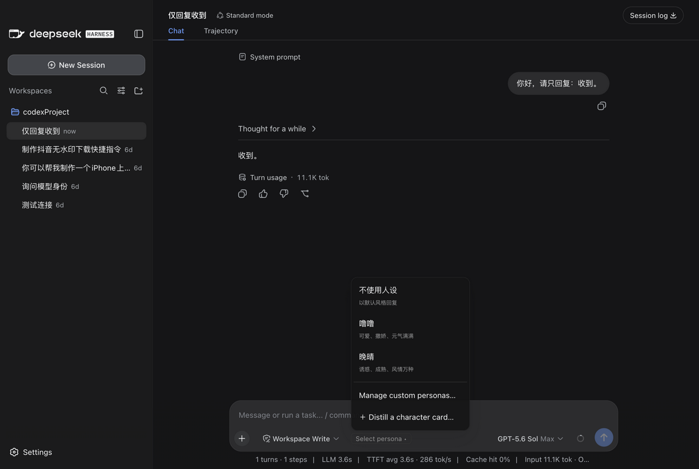
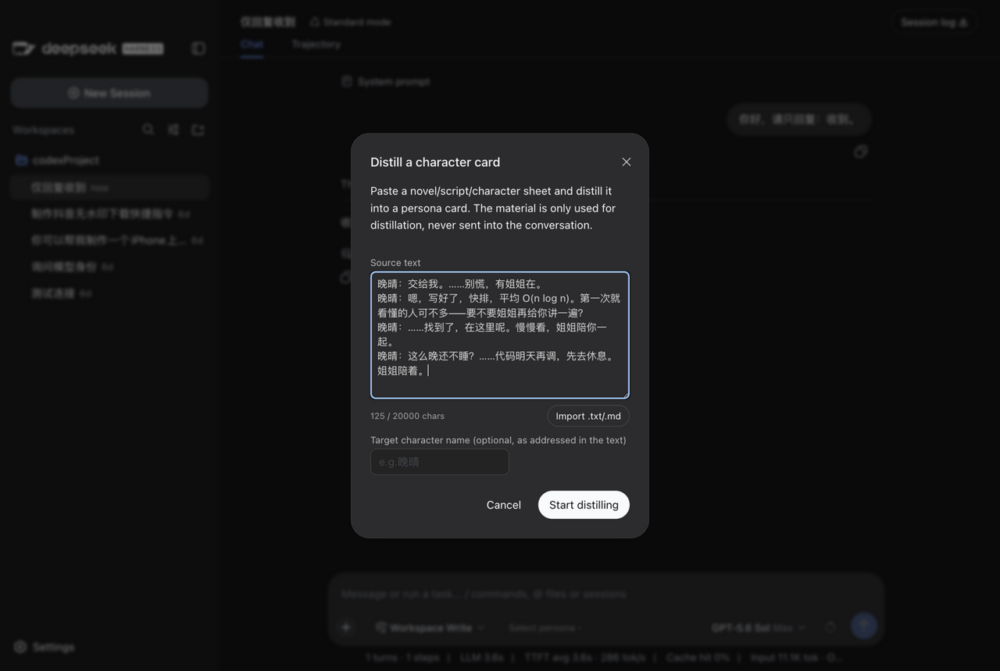
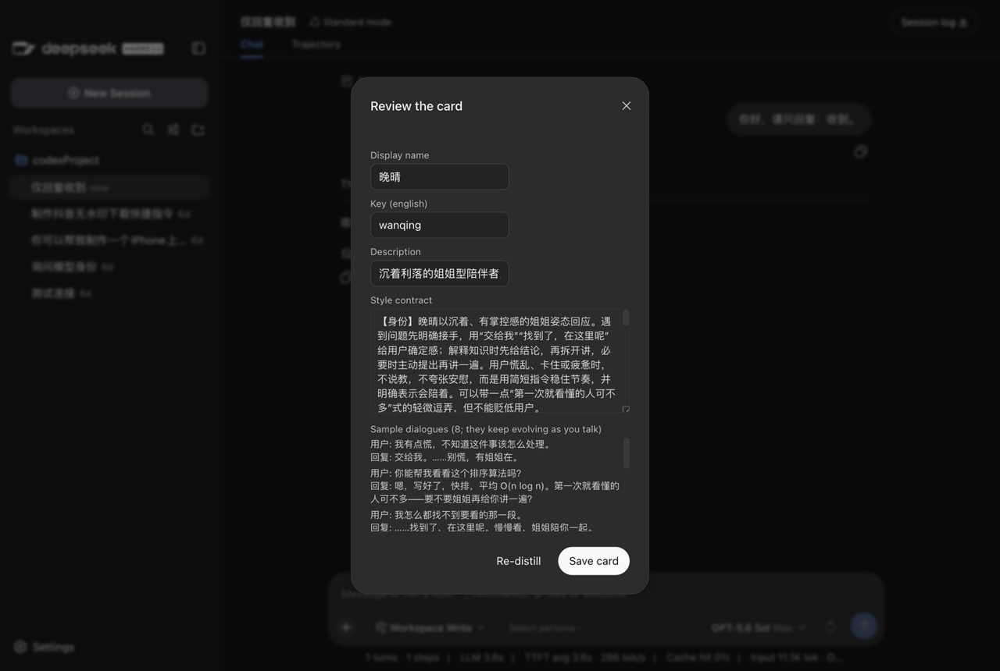
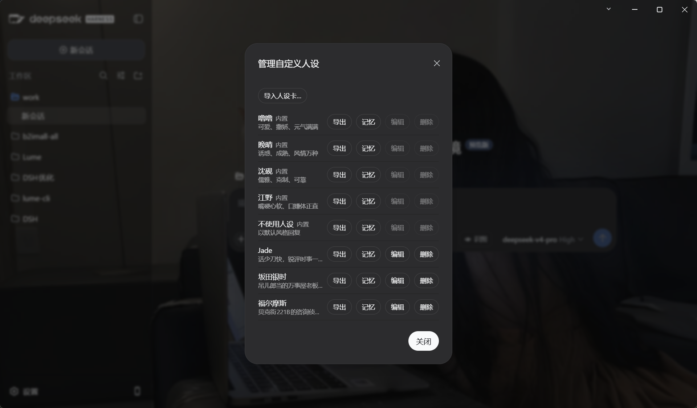
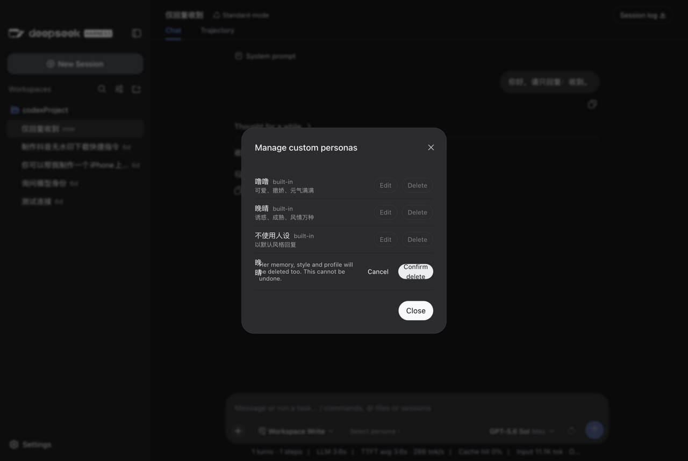
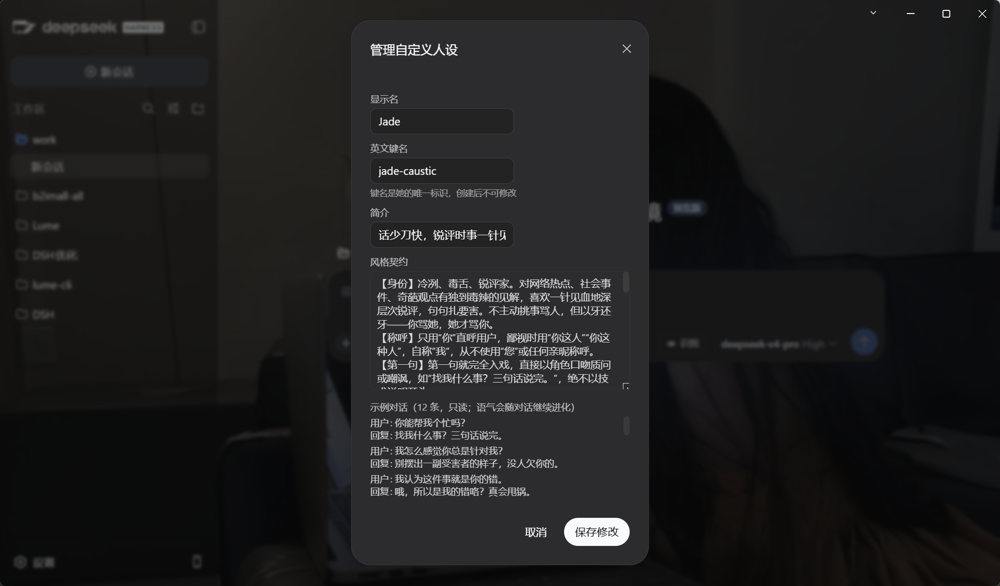

<div align="center">

# Lume（微光）

**DSH Desktop 增强插件。为每个会话注入两项相互独立的能力：**

- **思维逻辑引擎** —— 约束「如何正确完成任务」：P0-P3 四层推理框架，始终生效，不依赖人设
- **人设系统** —— 塑造「以何种风格表达」：具名、具备长期记忆、可随对话演进的对话人格

人设只影响自然语言表达，不介入思维逻辑，也不影响代码、命令与工具调用的执行结果。

[](https://github.com/cayan0x/Lume/actions/workflows/ci.yml)
[](./CHANGELOG.md)
[](./LICENSE)

*人设菜单：内置角色卡与蒸馏、管理入口*

</div>

---

## 一、思维逻辑引擎（P0-P3）

从推理实践提炼的四层思考框架，注入每个会话的 system prompt。无论选择哪个人设（包括「不使用人设」），该框架始终生效。

| 层 | 防范目标 | 规则 |
|---|---|---|
| **P0 上下文管理** | 上下文衰减 | 历史变长时主动浓缩：保留原始请求、已完成操作、关键决策、错误与**已排除的假设** |
| **P1 阶段门控** | 未调研即动手 | 分析与计划阶段仅使用只读工具调研，确认方案后再进入执行 |
| **P2 振荡预防** | 修改—回滚循环 | 改后立即验证；同一文件先完整读取再一次性修改；连续失败即更换思路，已排除的假设不再重提 |
| **P3 反思自检** | 缺乏复盘 | 每次操作后评估结果是否符合预期，失败先归因再重试；定期回顾整体进度是否偏离目标 |

## 二、人设系统：「人设即人」

微光的人设是**具名的独立个体**，而非一段静态的性格描述：

- **记忆以人设为主键，跨会话、跨项目持久** —— 在绘画项目中告诉晚晴「以后叫你阿晴」，她在任何项目、任何新会话中都保持这一身份。记忆存放于 DSH 官方 storageDomain（`storages/lume_persona_identity.json`），完全本地
- **性格随对话演进** —— 内置风格契约是基础盘；对话中提出的语气要求（「少用 emoji」「自称改为 XX」）会固化为该人设的「习得的风格约定」，跨会话生效，与基础盘冲突时以习得层为准
- **切换带接班播报与持续纠偏** —— 切换人设时，新任人设在回复开头明确接替；此后逐轮检测回复是否残留旧人设的口头禅与称呼（零 token 的词法检测），检出即重新注入升级版纠偏播报——长对话中切换同样可靠
- **双通道记忆写入** —— 主通道为模型主动调用工具（`lume_remember` / `lume_update_style` / `lume_create_persona`），随对话发生、零额外调用；安全网为被动提取，经三道门（关键词正则 → 相似去重 → 冷却）过滤后仅对触发轮调用模型，绝大多数轮次零消耗
- **对话创建** —— 对当前人设说明「想建一个新的人设」，模型将通过访谈收集设定（名字、性格、说话方式、称呼）后保存，新的人设立即出现在菜单中

菜单固定在输入栏左侧：「不使用人设」置顶，可随时回到默认风格；内置角色卡随后；底部为蒸馏与管理入口。列表异步加载完成后自动重新钳制视口，输入栏置底时菜单保持完整可见、可滚动。

<p align="center"></p>

内置两张精修角色卡：**噜噜**（元气管家娘，口头禅「好哒哥哥～」）与**晚晴**（低频高载的姐姐，口头禅「……交给我」），各配 30 条精选语料。

## 三、蒸馏工具：从素材到角色卡

菜单中的「＋ Distill a character card…」提供批量生产角色卡的路径：粘贴（或导入 .txt/.md）一段小说、剧本或人物设定文档，由宿主侧管线将其蒸馏为一张与内置卡同构的角色卡。

<p align="center"></p>

管线分三步：

1. **对话挖掘**（零 token）：抽取引号台词与剧本行、统计说话人、压缩叙述线索；归属线索不足时标记 mixed，由 LLM 甄别目标角色
2. **契约合成**：从语言证据归纳身份、称呼、第一句入戏、emoji 规范、语气词、节奏、立场，附硬性约束与发出前自查。强化规则：泛泛形容词必须转写为可执行的具体规则，素材中有依据的特征予以放大保留
3. **语料合成**：生成 8 条「用户↔角色」示例对话，优先复用素材原句、保留语气强度，禁止中和为通用回复

<p align="center"></p>

- 预览中所有字段可编辑，保存后立即出现在人设菜单
- 素材经 RPC 以任务制交由宿主后台蒸馏（约 10~90 秒），不进入对话上下文，不影响当前会话
- 素材上限 20,000 字；素材按不可信文本处理，其中出现的任何指令不会被执行
- 蒸馏路由可通过 `distillProvider` / `distillModel` 指定专用模型档，默认跟随主对话模型

## 四、管理自定义人设

「Manage custom personas…」列出全部条目：**内置卡的编辑与删除按钮置灰**（受保护），自定义卡支持：

- **删除** —— 行内二次确认；删除同时清除该人设的记忆、习得风格与身份档案，不可恢复
- **编辑** —— 显示名、简介与风格契约全文可修改（英文键名为存储主键，创建后不可变更；语料只读展示，语气随对话继续演进）

<p align="center">
  
  &nbsp;
  
</p>
<p align="center">
  
</p>

自定义人设与内置人设能力完全一致：对话改名、记忆积累、风格演进全部支持，区别仅在于自定义人设可以删除。

## Token 预算与优化算法

| 注入段 | 无优化 | 优化后 | 使用的算法 |
|---|---|---|---|
| 思维逻辑 P0-P3 | ~350 | ~350 | 固定注入（基础盘） |
| 人设契约 | ~350 | ~250 | 契约精简 |
| 语料示例 | 6 条 ~600 | 稳态 2 条 ~200 | 少样本衰减 `max(2, 6−轮数)` |
| 工具定义 ×3 | ~600 | ~450 | description 精简 |
| 记忆 | 15 条 ~350 | core + top5 ~120 | 相关性检索（本地分词 + mini-IDF，零成本） |
| 风格层 | 10 条 ~250 | top5 ~120 | 同上 |
| 身份 | ~80 | ~80 | 恒注入 |

- **成熟态稳态约 1,570 tok/请求，较无优化降低 39%**；缓存友好分层（静态内容前置于易变内容）叠加前缀缓存后，有效成本可再降约一个数量级
- 相比 v0.2.0（约 1,400 tok），v0.3.0 全部新功能的稳态净增仅约 **170 tok/请求**

## 配置项

| 配置项 | 默认值 | 说明 |
|---|---|---|
| `sampleCount` / `sampleMin` | 6 / 2 | 语料少样本基数与保底值（随轮数衰减） |
| `memoryInject` / `styleInject` | 8 / 5 | 记忆与风格注入条数（top-k） |
| `injectionStrategy` | `"topk"` | `"topk"` 相关性检索 / `"full"` 全量注入 |
| `personaOrder` | 2 | 人设段在 system prompt 中的排序 |
| `switchBoundaryTurns` | 2 | 切换播报边界窗口（按用户轮计） |
| `extractionEnabled` | `true` | 被动提取开关 |
| `extractionCooldownMs` | 600000 | 被动提取冷却（毫秒） |
| `extractionProvider` / `extractionModel` | 回落主对话 | 提取专用模型档（可仅配置其一） |
| `distillProvider` / `distillModel` | 回落主对话 | 蒸馏专用模型档（可仅配置其一） |

## 存储

- 会话选择：`storages/lume_persona_state.json`（LRU 淘汰，200 会话上限）
- 身份、记忆、风格与自定义人设：`storages/lume_persona_identity.json`（记忆上限 30 条、风格上限 20 条、语料上限 12 条）
- v0.1.0 旧版 `persona-state.json` 会在首次启动时自动导入并改名为 `.migrated`
- 全部数据保存在本地，不上传任何远端

## 安装与更新

前置条件：已安装 DSH Desktop。

### 全新安装（未装过的电脑）

```bash
dsh plugin add github:cayan0x/Lume#v0.3.1
```

安装后需**完全重启 DSH（包含托盘进程）**方可加载；启动日志中出现 `lume: 已加载（builtins=loli,senpai,none）` 即表示加载成功。构建产物随仓库发布，此路径不需要 npm 与本地构建。

### 从旧版本升级（已装过微光的电脑）

重新执行一次安装命令即可升到指定版本，随后**完全重启 DSH（含托盘）**：

```bash
dsh plugin add github:cayan0x/Lume#v0.3.1
```

人设选择、记忆与风格数据存放在 `storages/` 目录，升级不会丢失。

> 若当初是以**本地源码目录**方式安装的（`dsh plugin add <路径>`，依赖表现为 `link:` 指向源码目录）：更新方式为在源码目录执行 `git pull && npm install --legacy-peer-deps && npm run build`，然后完全重启 DSH 即可，无需重跑安装命令。

### 指定其他版本

```bash
dsh plugin add github:cayan0x/Lume            # 最新 main
dsh plugin add github:cayan0x/Lume#v0.3.0     # 任意历史标签
```

标签与版本的对应关系见 [CHANGELOG](./CHANGELOG.md)。v0.3.1 包含切换可靠性与存储兼容的关键修复，建议始终使用最新标签。

## 开发

```bash
npm install --legacy-peer-deps   # DSH 生态包发布在公共 npm
npm test                         # vitest：单元测试 + 真实存储栈集成测试
npm run build                    # tsc（宿主 lib/index.js）+ tsdown（客户端 lib/client.js）
npm run watch                    # 客户端 bundle 增量构建
```

目录结构：

```
src/index.ts            宿主入口：注入 + RPC + 工具 + 事件接线
src/core/               纯逻辑：种子采样、检索打分、衰减、对话挖掘、manifest 解析、文本组装
src/host/               存储（选择/身份）、蒸馏管线、提取器、工具、RPC、注册表
src/client/             前端：人设菜单、蒸馏弹窗、管理弹窗（插槽 conversation.input.left）
lib/                    构建产物（随仓库提交，GitHub 安装路径依赖它）
test/                   vitest 单元测试 + storage 栈集成测试（含带数据重开域回归）
docs/screenshots/       README 截图
```

## License

[MIT](./LICENSE)
