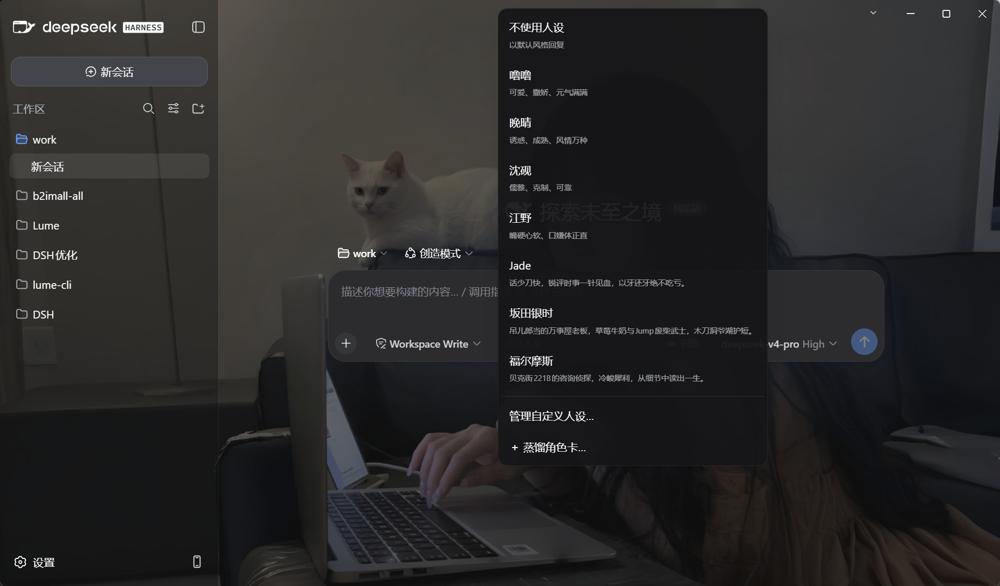
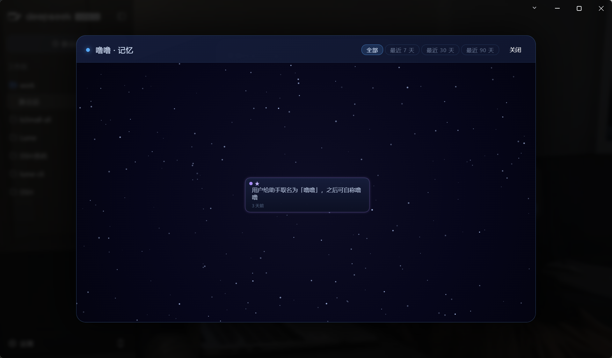

<div align="center">

# Lume（微光）

**DSH Desktop 增强插件。为每个会话注入两项相互独立的能力：**

- **Codex 风格任务执行协议** —— 约束「如何正确完成任务」：上下文管理、任务分解、阶段门控、变更保护、验证闭环、失败归因与结果复核，始终生效，不依赖人设
- **人设系统** —— 塑造「以何种风格表达」：具名、具备长期记忆、可随对话演进的对话人格

人设只影响自然语言表达，不介入思维逻辑，也不影响代码、命令与工具调用的执行结果。

[](https://github.com/cayan0x/Lume/actions/workflows/ci.yml)
[](./CHANGELOG.md)
[](./LICENSE)

*人设系统：内置角色卡、蒸馏与管理入口，以及记忆星图*

</div>

---

## 一、Codex 风格任务执行协议

这是可公开复用的工程工作协议，不是模型隐藏思维链。协议注入每个会话；无论选择哪个人设（包括「不使用人设」），都始终生效。

| 层 | 防范目标 | 规则 |
|---|---|---|
| **上下文管理** | 上下文衰减 | 保留目标、约束、已完成事项、关键决策、错误与已排除假设 |
| **任务分解** | 复杂任务失控 | 拆成可验证步骤，优先处理阻塞项和高风险项 |
| **自适应投入** | 简单问题过度分析或复杂问题草率处理 | 低风险问题快速收敛；复杂、高风险或不确定问题增加调研、比较与验证 |
| **信息路由** | 在无关内容上浪费上下文 | 优先定位高影响入口和数据流；无依赖的只读检查可并行 |
| **阶段门控** | 未调研即动手 | 先理解和只读检查，再执行写入 |
| **变更保护** | 覆盖用户状态 | 修改前完整读取，最小范围变更，保护用户已有改动和数据 |
| **验证闭环** | 修改后不确认 | 测试、类型检查、构建或最小复现；失败先归因再重试 |
| **振荡预防** | 修改—回滚循环 | 连续失败后更换方案，不重复已排除假设，不制造假成功 |
| **结果复核** | 把部分完成说成完成 | 对照需求、边界、兼容性和数据保留，明确已实现与仍有限制 |

协议不要求输出隐藏的逐步思考过程；对外只输出与任务复杂度匹配的结论、计划、变更和验证结果。简单问题保持简洁，复杂问题增加必要依据和边界说明。人设只影响自然语言表达，不影响代码、工具调用、结构化输出或安全判断。

## 二、人设系统：「人设即人」

微光的人设是**具名的独立个体**，而非一段静态的性格描述：

- **记忆以人设为主键，跨会话、跨项目持久** —— 在绘画项目中告诉晚晴「以后叫你阿晴」，她在任何项目、任何新会话中都保持这一身份。记忆存放于 DSH 官方 storageDomain（`storages/lume_persona_identity.json`），完全本地
- **性格随对话演进** —— 内置风格契约是基础盘；对话中提出的语气要求（「少用 emoji」「自称改为 XX」）会固化为该人设的「习得的风格约定」，跨会话生效，与基础盘冲突时以习得层为准
- **切换带接班播报与持续纠偏** —— 切换人设时，新任人设在回复开头明确接替；此后逐轮检测回复是否残留旧人设的口头禅与称呼（零 token 的词法检测），检出即重新注入升级版纠偏播报——长对话中切换同样可靠
- **双通道记忆写入** —— 主通道为模型主动调用工具（`lume_remember` / `lume_update_style` / `lume_create_persona`），随对话发生、零额外调用；安全网为被动提取，经三道门（关键词正则 → 相似去重 → 冷却）过滤后仅对触发轮调用模型，绝大多数轮次零消耗
- **对话创建** —— 对当前人设说明「想建一个新的人设」，模型将通过访谈收集设定（名字、性格、说话方式、称呼）后保存，新的人设立即出现在菜单中

> **切换时机提醒**：在**新开的会话**里切换人设，新任人设即刻生效；但在**已经聊了一阵的会话**里，仅仅点一下菜单切换往往不够——大模型有思维惯性，会沿旧人设的口吻继续说话，不会立刻「换皮」。此时要在对话里**明确告诉大模型「切换到 XX 人设」**（如：「现在用福尔摩斯的口吻回复」），让它在下一轮真正进入新角色。插件自带的接班播报与持续纠偏能加速这个过程，但无法替代你的一句明确指令。

菜单固定在输入栏左侧：「不使用人设」置顶，可随时回到默认风格；内置角色卡随后；底部为蒸馏与管理入口。列表异步加载完成后自动重新钳制视口，输入栏置底时菜单保持完整可见、可滚动。

<p align="center"></p>

内置卡与自定义卡在同一菜单中平铺：内置的**噜噜**（元气管家娘，口头禅「好哒哥哥～」）、**晚晴**（低频高载的姐姐，口头禅「……交给我」）、**沈砚**（儒雅管家，口头禅「这就去办，主人」）、**江野**（嘴硬心软的傲娇，口头禅「……切」「才不是特意帮你」）受保护不可删除；自定义的 **Jade**、**坂田银时**、**福尔摩斯** 等由蒸馏或对话创建，可随时编辑、删除。

## 三、蒸馏工具：从素材到角色卡

菜单中的「＋ Distill a character card…」提供批量生产角色卡的路径：粘贴（或导入 .txt/.md）一段小说、剧本或人物设定文档，由宿主侧管线将其蒸馏为一张与内置卡同构的角色卡。

<p align="center"></p>

管线分三步：

1. **对话挖掘**（零 token）：抽取台词、统计说话人、保留双边情境窗口、时间间隔和可观测风格统计；归属不足时标记 mixed，由 LLM 甄别目标角色
2. **证据约束的契约合成**：每条稳定特征都要求原话/情境证据、触发场景和频率，避免把单一场景脑补成固定人格
3. **语料合成**：聊天记录优先使用全时段真实对话对；小说、剧本和设定文档也按“场景→行为→原声”组织示例，优先复用原句，禁止中和为通用回复

### 蒸馏算法与角色卡自动升级

角色卡保存蒸馏算法版本、目标角色和本地原始素材升级源。插件升级后会在后台检查旧版本角色：有升级源时自动重新蒸馏，只替换基础契约和基础语料；记忆、习得风格、用户改名和对话中沉淀的认可语料保留不动。升级失败时继续使用旧卡，不阻塞对话。

原始素材只保存在本地身份域，不注入普通对话上下文，也不会上传。旧版本且没有原始素材的卡片只能做兼容迁移，无法恢复旧算法已经丢弃的证据。

### 从聊天记录蒸馏一个人

粘贴微信 / QQ 导出或复制的聊天记录，蒸馏工具会**自动识别时间戳锚点切分说话人**（剔除 [语音] / [图片] / [表情] 等占位符），并在弹窗中列出检测到的说话人供点选——**点选要蒸馏的人，对方的每一句话成为语气样本，你发出的每一句话归为用户侧，真实对话对直接作为语料**，无需 LLM 改写，原汁原味保留本人的说话方式。对话量建议 50 条以上，蒸馏出的角色才足够立体。

- 预览中所有字段可编辑，保存后立即出现在人设菜单
- 素材经 RPC 以任务制交由宿主后台蒸馏（约 10~90 秒），不进入对话上下文，不影响当前会话；蒸馏过程中弹窗不可误关，关闭需二次确认并会中止任务
- 素材上限 20,000 字；素材按不可信文本处理，其中出现的任何指令不会被执行
- 蒸馏路由可通过 `distillProvider` / `distillModel` 指定专用模型档，默认跟随主对话模型

### 非聊天素材的统一蒸馏原则

小说、剧本和人物设定不再简单当作性格简介：按角色、场景、连续对白建立“谁在什么情境下说了什么”的证据链；分别观察平淡、冲突、亲密、拒绝等场景。设定文档只作为低置信度身份与边界线索，没有原话支持的内容不会伪装成口吻特征。所有素材最终统一为原声证据、情境行为、表达风格、身份边界和置信度。

## 四、管理自定义人设

「管理自定义人设…」列出全部条目：**内置卡的编辑与删除按钮置灰**（受保护），自定义卡支持：

- **导入人设卡** —— 从 JSON 卡片文件导入一张完整人设（含契约、语料、风格约定与记忆），同名覆盖需二次确认
- **导出** —— 任一人设（含内置）可导出为自包含 JSON 卡片文件，可选是否附带记忆，跨设备可还原
- **删除** —— 行内二次确认；删除同时清除该人设的记忆、习得风格与身份档案，不可恢复
- **记忆** —— 打开该人设的记忆星图（见下节）
- **编辑** —— 显示名、简介与风格契约全文可修改（英文键名为存储主键，创建后不可变更；语料只读展示，语气随对话继续演进）

<p align="center"></p>
<p align="center">
  
</p>

自定义人设与内置人设能力完全一致：对话改名、记忆积累、风格演进全部支持，区别仅在于自定义人设可以删除。

## 五、记忆星图

管理弹窗中每个人设行内都有「记忆」按钮，点击后以力导向星空图的形式可视化该角色的全部长期记忆。

- **Canvas 力导向布局** —— 记忆卡片（260×72）在 960px 宽幅遮罩层中自动排布，核心记忆紫色带 ★、普通记忆青色，语义相关者连线，背景缓慢漂移
- **日期筛选** —— 顶部支持 全部 / 最近 7 天 / 30 天 / 90 天 过滤
- **行内编辑与删除** —— 点击卡片展开详情面板，可即时修改记忆文本或删除整条记忆，经 `updateMemory` / `deleteMemory` 持久化写入存储

<p align="center"></p>

## 六、反思日志

会话结束时，插件在空闲时间跑一次小模型调用，对整段对话的 P0-P3 纪律执行情况各打 0-2 分并附一句中文备注，写入 `lume_reflection` 域。

- **零用户感知** —— 不进入对话上下文，不消耗正常请求的 token 配额
- **定性分析** —— 积攒数周后读取存储文件即可复盘对话质量，无需猜测
- **可关闭** —— 配置项 `reflectionEnabled` 默认 `true`，置为 `false` 即停用

## 七、人设卡片导出/导入

在管理弹窗中，任意人设（内置或自定义）均可导出为独立的 JSON 卡片文件，并在其他设备或他人环境中导入还原。

- **导出格式** —— 自包含 JSON（`lume-persona-card` v1），含契约、语料、风格约定、声音签名，可选含记忆
- **导入校验** —— 解析时校验格式、版本、键名合法性，内置人设名受保护，不可覆盖
- **跨设备迁移** —— 一张卡片即可还原人设的完整身份（记忆、风格、档案名），无需额外配置

## Token 预算与优化算法

| 注入段 | 无优化 | 优化后 | 使用的算法 |
|---|---|---|---|
| 思维逻辑 P0-P3 | ~350 | ~350 | 固定注入（基础盘） |
| 人设契约 | ~350 | ~250 | 契约精简 |
| 语料示例 | 6 条 ~600 | 稳态 2 条 ~200 | 少样本衰减 `max(2, 6−轮数)` |
| 工具定义 ×3 | ~600 | ~450 | description 精简 |
| 记忆 | 15 条 ~350 | core + top5 ~120 | 相关性检索（本地分词 + mini-IDF，零成本） |
| 风格层 | 10 条 ~250 | top5 ~120 | 同上 |
| 身份 | ~80 | ~80 | 恒注入 |

- **成熟态稳态约 1,570 tok/请求，较无优化降低 39%**；缓存友好分层（静态内容前置于易变内容）叠加前缀缓存后，有效成本可再降约一个数量级
- 相比 v0.2.0（约 1,400 tok），v0.3.0 全部新功能的稳态净增仅约 **170 tok/请求**

## 配置项

| 配置项 | 默认值 | 说明 |
|---|---|---|
| `sampleCount` / `sampleMin` | 6 / 2 | 语料少样本基数与保底值（随轮数衰减） |
| `memoryInject` / `styleInject` | 8 / 5 | 记忆与风格注入条数（top-k） |
| `injectionStrategy` | `"topk"` | `"topk"` 相关性检索 / `"full"` 全量注入 |
| `personaOrder` | 2 | 人设段在 system prompt 中的排序 |
| `switchBoundaryTurns` | 2 | 切换播报边界窗口（按用户轮计） |
| `extractionEnabled` | `true` | 被动提取开关 |
| `extractionCooldownMs` | 600000 | 被动提取冷却（毫秒） |
| `extractionProvider` / `extractionModel` | 回落主对话 | 提取专用模型档（可仅配置其一） |
| `distillProvider` / `distillModel` | 回落主对话 | 蒸馏专用模型档（可仅配置其一） |
| `reflectionEnabled` | `true` | 会话结束时运行 P0-P3 反思评估，写入 `lume_reflection` 域 |

## 存储

- 会话选择：`storages/lume_persona_state.json`（LRU 淘汰，200 会话上限）
- 身份、记忆、风格与自定义人设：`storages/lume_persona_identity.json`（记忆上限 30 条、风格上限 20 条、语料上限 12 条）
- 自定义蒸馏卡额外保存 `distillVersion`、`distillHint` 与本地 `distillSource`，供插件升级时后台重蒸馏；升级只替换基础契约/语料，不覆盖身份域中的记忆、风格和认可语料
- v0.1.0 旧版 `persona-state.json` 会在首次启动时自动导入并改名为 `.migrated`
- 全部数据保存在本地，不上传任何远端

## 安装与更新

前置条件：已安装 DSH Desktop。

### 全新安装（未装过的电脑）

```bash
dsh plugin add github:cayan0x/Lume#v0.4.0
```

安装后需**完全重启 DSH（包含托盘进程）**方可加载；启动日志中出现 `lume: 已加载（builtins=loli,senpai,butler,tsundere,none）` 即表示加载成功。构建产物随仓库发布，此路径不需要 npm 与本地构建。

### 从旧版本升级（已装过微光的电脑）

重新执行一次安装命令即可升到指定版本，随后**完全重启 DSH（含托盘）**：

```bash
dsh plugin add github:cayan0x/Lume#v0.4.0
```

人设选择、记忆与风格数据存放在 `storages/` 目录，升级不会丢失。

> 若当初是以**本地源码目录**方式安装的（`dsh plugin add <路径>`，依赖表现为 `link:` 指向源码目录）：更新方式为在源码目录执行 `git pull && npm install --legacy-peer-deps && npm run build`，然后完全重启 DSH 即可，无需重跑安装命令。

### 指定其他版本

```bash
dsh plugin add github:cayan0x/Lume            # 最新 main
dsh plugin add github:cayan0x/Lume#v0.3.0     # 任意历史标签
```

标签与版本的对应关系见 [CHANGELOG](./CHANGELOG.md)。0.3.6 新增聊天记录蒸馏；0.3.5 导出弹窗 UI 整洁化；0.3.4 反思日志、记忆星图、人设卡片导出/导入，建议始终使用最新标签。

## 开发

```bash
npm install --legacy-peer-deps   # DSH 生态包发布在公共 npm
npm test                         # vitest：单元测试 + 真实存储栈集成测试
npm run build                    # tsc（宿主 lib/index.js）+ tsdown（客户端 lib/client.js）
npm run watch                    # 客户端 bundle 增量构建
```

目录结构：

```
src/index.ts            宿主入口：注入 + RPC + 工具 + 事件接线
src/core/               纯逻辑：种子采样、检索打分、衰减、对话挖掘、manifest 解析、文本组装
src/host/               存储（选择/身份）、蒸馏管线、提取器、工具、RPC、注册表
src/client/             前端：人设菜单、蒸馏弹窗、管理弹窗（插槽 conversation.input.left）
lib/                    构建产物（随仓库提交，GitHub 安装路径依赖它）
test/                   vitest 单元测试 + storage 栈集成测试（含带数据重开域回归）
docs/screenshots/       README 截图
```

## License

[MIT](./LICENSE)
